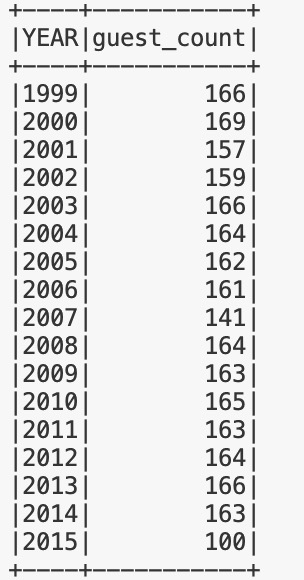

# ETL-Query Lab: Data Processing with Spark

This project contains a Python command-line interface (CLI) application that processes the dataset of guests who have appeared on The Daily Show. The dataset is extracted from FiveThirtyEight's GitHub repository.

## Overview:
The application performs the following tasks:

- Extracts the dataset from the given URL.
- Initiates a Spark session with a defined application name.
- Loads the dataset into a Spark DataFrame.
- Runs a SQL query to count the number of guests per year.
- Ends the Spark session.

## Getting Started:

To run the application, execute the following command from the root directory of the project:
python main.py

## result
The result of query:
